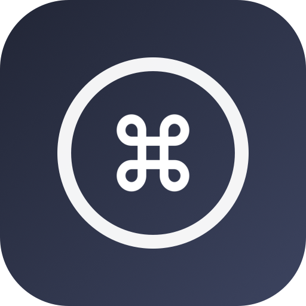
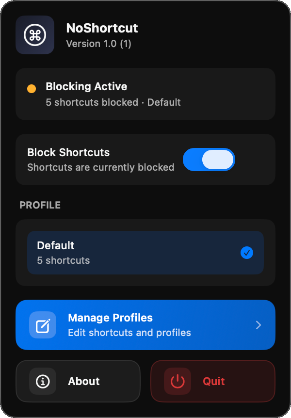
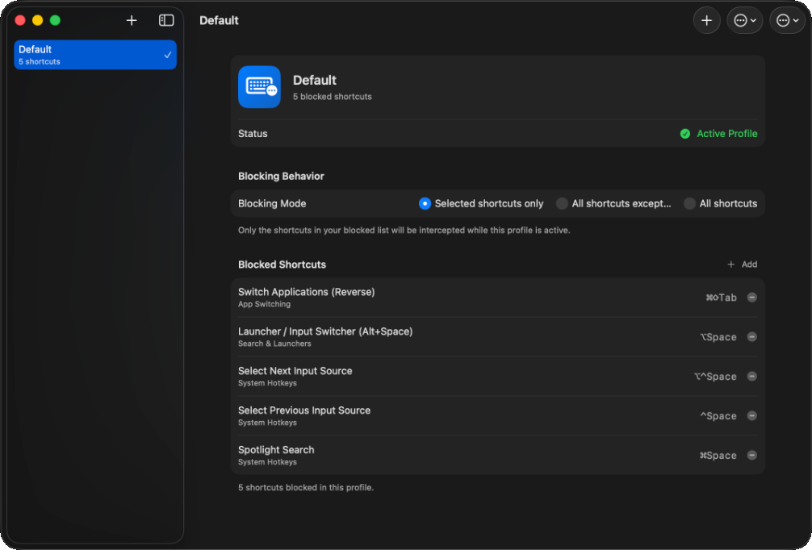

  

# NoShortcut

A lightweight macOS menu bar app that temporarily disables selected keyboard shortcuts using profiles.

  
  

## Features

- Menu bar icon with quick toggle on/off
- Runs silently in the background (no Dock icon)
- Create multiple profiles with different sets of shortcuts to block
- Switch between profiles instantly
- Pre-populated useful default profiles
- Global low-level key interception (requires Input Monitoring permission)

## Requirements

- macOS 13.0 (Ventura) or later
- Xcode 14+ (to build)

## Setup & Build

1. Install full Xcode from the Mac App Store (Command Line Tools alone is not enough).

2. Open the Xcode project:
   - Double-click `NoShortcut.xcodeproj` in the project root to open it in Xcode.

3. Build & Run (⌘R):
   - Choose the `NoShortcut` scheme and your Mac as the run destination.
   - Press **⌘R** (or click the Run button) to build and launch the app.

> [!NOTE]
> The project is fully configured:
> - **Deployment Target**: macOS 13.0
> - **LSUIElement**: Set to `YES` (making it an accessory/agent app with no Dock icon).
> - **App Sandbox**: Disabled (as session-level event taps for key interception are not supported inside the sandbox).

## Permissions

On first run (or when you turn on "Disable Shortcuts"), the app needs **Input Monitoring** permission:

1. The app will fail silently to block if permission is missing.
2. Go to **System Settings → Privacy & Security → Input Monitoring**
3. Click the lock to unlock.
4. Add/check "NoShortcut" (it may appear after first attempt to tap).

You can also add a button inside the app (in the manager) that opens the correct pane:

`x-apple.systempreferences:com.apple.preference.security?Privacy_ListenEvent`

## Usage

1. Click the menu bar icon (keyboard symbol).
2. Toggle **Disable Shortcuts** — this activates blocking for the currently selected profile.
3. Use the **Profile** menu to switch between different sets of blocked shortcuts.
4. Click **Manage Profiles...** to:
   - Create / rename / delete profiles
   - For each profile choose **"Block only the shortcuts I pick"** or **"Block ALL shortcuts"**
   - When using **"Block only the shortcuts I pick"**:
     - You get a categorized list of common macOS shortcuts with checkboxes
     - One-click **"Select Recommended for Wine Gaming"** button (perfect for Wine/Whisky/CrossOver)
     - Freely toggle any common shortcut
     - You can still **Add Custom** (record any combination manually)
     - The "Active in this profile" list lets you remove any shortcut (predefined or custom)
   - When using "Block ALL", every ⌘ / ⌥ / ⌃ combination + F-keys are blocked (normal typing still works)
6. The blocking applies system-wide immediately.

## How It Works

- Uses `CGEventTap` at the session level (`kCGSessionEventTap`) to intercept `keyDown` and `flagsChanged`.
- When blocking is active for the current profile, matching key combinations are consumed (never reach apps or the system).
- Profiles are stored in `~/Library/Application Support/NoShortcut/profiles.json`.
- State (last profile + enabled) is restored on launch.

## Limitations & Notes

- Some deeply integrated system shortcuts (full-screen Mission Control gestures, certain Fn keys, Touch Bar, Stage Manager) may not be fully blockable via event tap.
- Cmd+Tab / app switching is partially suppressible; the OS Dock may still show UI in some cases.
- Text input (letters without modifiers) is **never** blocked.
- Copy/paste (⌘C / ⌘V) will only be blocked if you explicitly added them to the active profile.
- The app is intentionally minimal — no cloud sync, no iCloud, plain local JSON.

## Default Profiles (auto-created on first launch)

Default profiles (all use **"Block only specific shortcuts"** mode):

- **Safe (No Quit)**: ⌘Q, ⌘⇧Q
- **Focus Mode**: ⌘Q, ⌘W, ⌘Tab, ⌘`, ⌘Space, ⌘⇧Tab
- **Wine Gaming**: A sensible starting set of the most common macOS shortcuts that break input in Wine/Whisky/CrossOver games (⌘Tab, ⌘Space, ⌘Q, F3/F4 etc.)

You can also create profiles with **"Block ALL shortcuts"** mode (blocks everything with modifiers or F-keys).

Feel free to edit or add your own.

## Development Tips

- While developing in Xcode, the app may appear in the Dock. Set activation policy in `AppDelegate` to experiment.
- To force-quit during testing: Activity Monitor or `killall NoShortcut`.
- Logs (print statements) appear in Xcode console.

## Future Ideas

- Hotkey to toggle (e.g. a secret combo that is never blocked)
- Import/export profiles
- Better visual key recorder (show pressed modifiers live)
- Per-app exceptions
- Launch at login (using `SMAppService`)

## Inspiration & Acknowledgements

- Inspired by other excellent open-source macOS menu bar utilities like [stats](https://github.com/exelban/stats).

## License

This project is licensed under the MIT License - see the [LICENSE](LICENSE) file for details.

---

Built for the "no-shortcut" use case. Enjoy distraction-free or presentation-safe macOS sessions!

## Quick Xcode Setup Checklist (TL;DR)

1. New Project → macOS App (SwiftUI)
2. Delete default `ContentView.swift` and replace `NoShortcutApp.swift`
3. Copy all `.swift` files + `Info.plist` from this folder
4. In target settings:
   - macOS Deployment Target ≥ 13.0
   - Add `LSUIElement = YES` (or reference the provided Info.plist)
   - Turn **off** App Sandbox
5. Add `@NSApplicationDelegateAdaptor(AppDelegate.self)` (already in the provided `NoShortcutApp.swift`)
6. Build → Run
7. Grant **Input Monitoring** permission the first time you enable blocking
8. Click the menu bar keyboard icon → toggle & enjoy!

## Project Files (all provided)

| File                        | Purpose                              |
|-----------------------------|--------------------------------------|
| `NoShortcutApp.swift`       | @main SwiftUI App + scenes           |
| `AppDelegate.swift`         | Sets `.accessory` policy + behavior  |
| `ProfileStore.swift`        | Observable state + persistence       |
| `ShortcutDisabler.swift`    | CGEventTap implementation            |
| `Models.swift`              | Shortcut, Profile, defaults, mapper  |
| `MenuBarView.swift`         | Menu bar contents & quick actions    |
| `ProfileManagerView.swift`  | Sidebar + detail UI for editing      |
| `ShortcutRecorderView.swift`| Captures new shortcuts live          |
| `Info.plist`                | Reference (LSUIElement etc)          |
| `NoShortcut.entitlements`   | Placeholder                          |
| `README.md`                 | This file                            |

Happy coding!